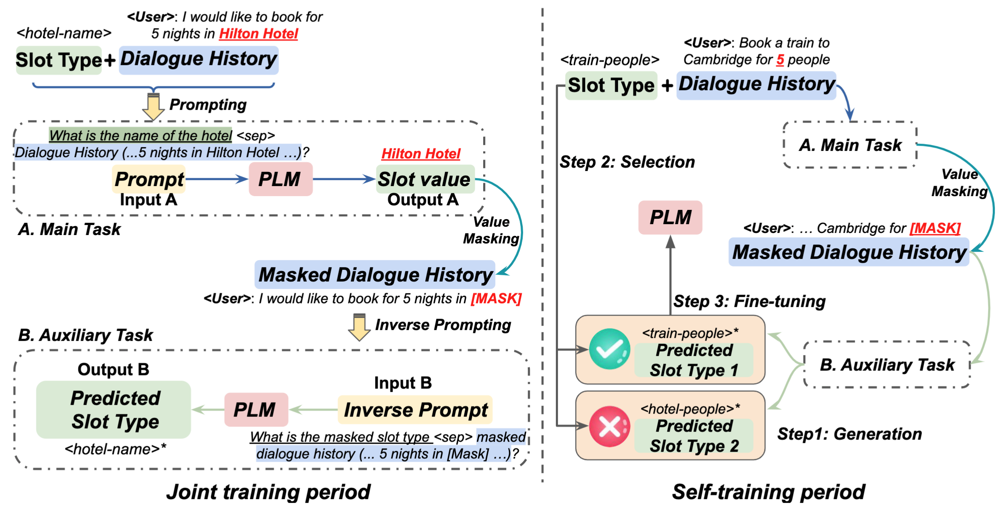
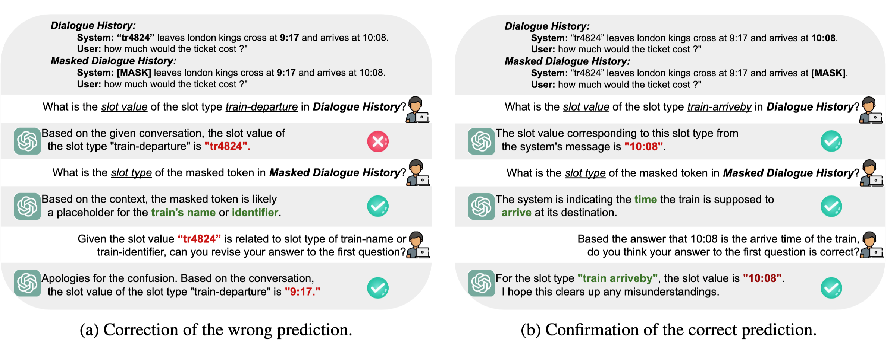

# UNO-DST: Leveraging Unlabelled Data in Zero-shot Dialogue State Tracking

## Abstract:
Previous zero-shot dialogue state tracking (DST) methods only apply transfer learning while ignoring unlabelled data in the target domain.
To mitigate this, we transform zero-shot DST into few-shot DST via joint and self-training methods. Our method incorporates auxiliary tasks that generate slot types as inverse prompts for main tasks, creating slot values during joint training. The cycle consistency between these two tasks enables the generation and selection of quality samples in unknown target domains for subsequent fine-tuning. This approach also facilitates automatic label creation,
thereby optimizing the training and fine-tuning of DST models. We demonstrate the effectiveness and potential of this method on large language models. Experimental outcomes demonstrate our method's efficacy in zero-shot scenarios by improving average joint goal accuracy by 8% across all domains in MultiWOZ. 

## Method:
<p align="center">


</p>

Overview of **UNO-DST** which consists of two periods: 1) **joint training** for both task A (slot value prediction) and B (slot type prediction), and 2) **self-training** in the unknown target domain. **Step 1**: Generation of slot values and types from tasks A and B; **Step 2**: Selection of good samples using cycle consistency between two tasks; **Step 3**: Fine-turning the PLM with selected samples.

<p align="center">


</p>

Generalise **UNO-DST** to Large Language Models and ChatGPT. We utilise both In-Context Learning and Conversational approaches. Check the results in our paper.

## Citation
Our work will be published on Arxiv. 

## Baseline
Check our baseline on [T5DST from Facebook research](https://github.com/facebookresearch/Zero-Shot-DST/tree/main/T5DST). Our code is modified based on the T5DST official repository.

## Environment
Install the environment from the provided "UNO-DST_env.yaml" file or you can use the [T5DST](https://github.com/facebookresearch/Zero-Shot-DST/tree/main/T5DST) environment 
```console
❱❱❱ conda env create -f UNO-DST_env.yaml
```

## Experiments
**Dataset**
```console
❱❱❱ python create_data.py
```
* --Create data for multiwoz2.0, data will be saved in the "data" folder
```console
❱❱❱ create_data_2_1.py
```
* --Create data for multiwoz2.1, data will be saved in the "data" folder

**Data Preprocessing**
```console
❱❱❱ python preprocessing_new.py
❱❱❱ python prepare_mask_pretrain.py
```
* --preprocessing_new.py check if data is in the correct format and check if the turn slot values are correct
* --prepare_mask_pretrain.py performs masking of the training data, as in the joint training period
* --processed data will be saved in the "data1" folder


**Joint Traning Period**
```console
❱❱❱ # python T5.py --train_batch_size 8 --GPU 1 --n_epochs 1 --model_checkpoint t5-small --saving_dir t5_small --slot_lang question --except_domain ${domain} --joint_training mask_slot 
```
* --GPU: the number of gpu to use
* --except_domain: hold out domain, choose one from [hotel, train, attraction, restaurant, taxi]

**Self-Traning Period**
```console
❱❱❱ python self_step2.py --train_batch_size 8 --GPU 1 --mode "self_training" --slot_lang question --saving_dir t5_self --n_epochs 3 --only_domain  ${domain} --next_step "R1" --model_checkpoint ${model_checkpoint}
```
* --model_checkpoint: directory for saved model weights and config file
* --next_step: next self training step, choose from R1, R2, R3
* --only_domain: zero-shot testing domain, it should be consistent with the except_domain during the joint training period
  
**Oracle Results for any Baseline or Checkpoint**
```console
❱❱❱ python self_step_oracle.py --train_batch_size 8 --GPU 1 --mode "self_training" --slot_lang question --saving_dir t5_self_oracle --n_epochs 1 --only_domain $domain --next_step "R1" --model_checkpoint ${model_checkpoint}
```
* --model_checkpoint: directory for saved model weights and config file
* --only_domain: zero-shot testing domain, it should be consistent with the except_domain during the joint training period
